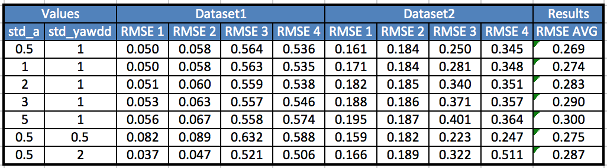
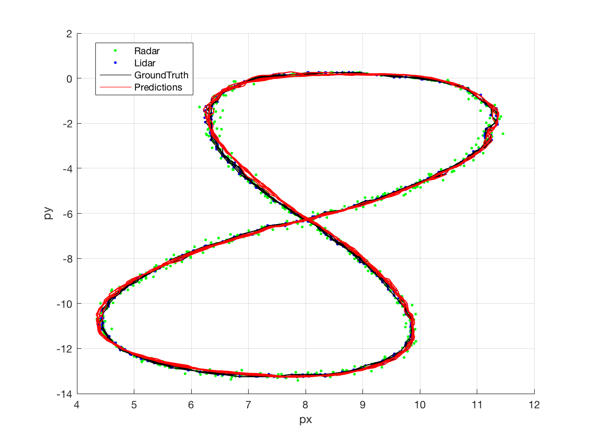
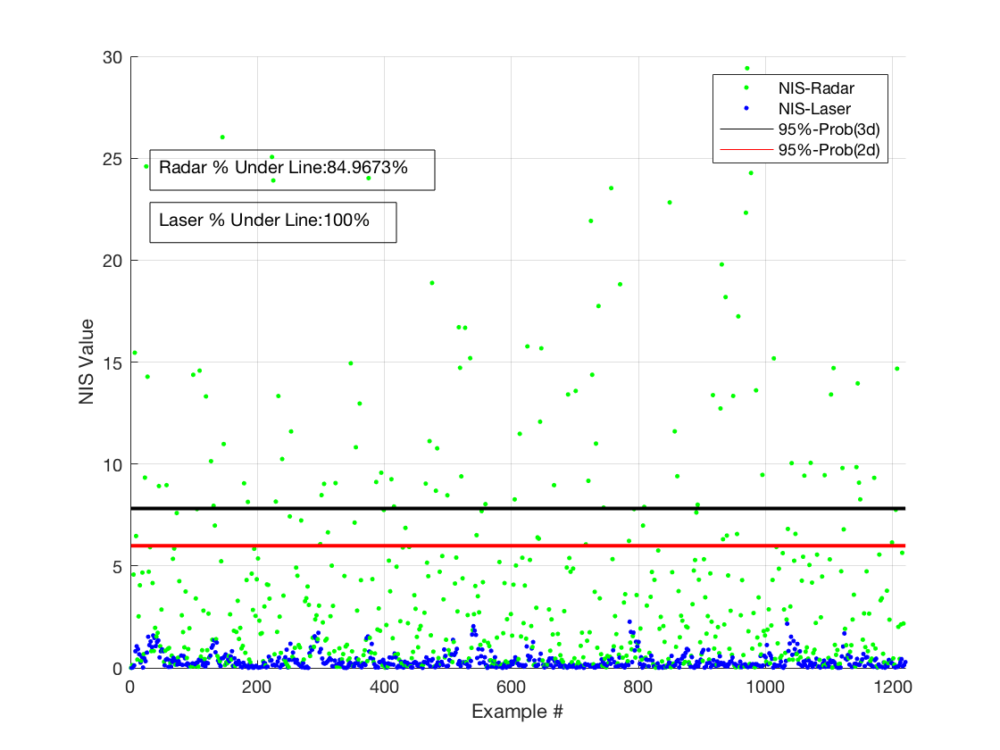
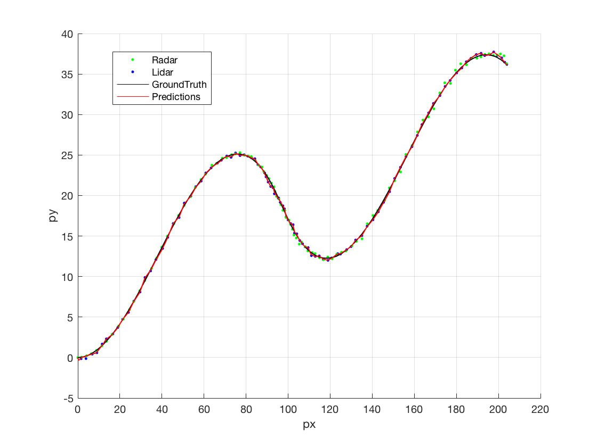
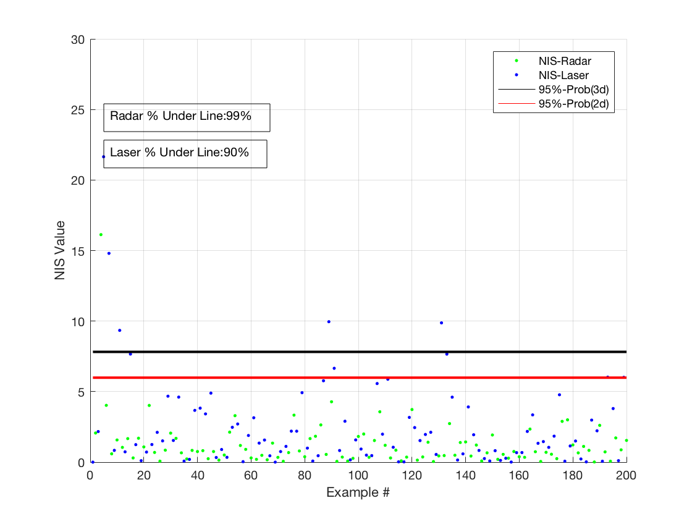
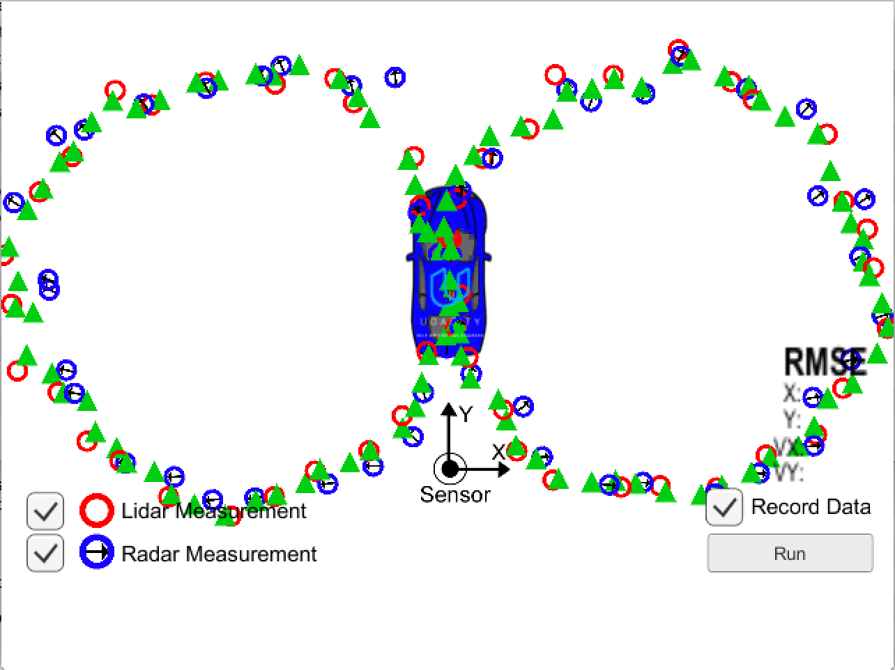

# Unscented Kalman Filter Project

By: Chris Gundling, chrisgundling@gmail.com

Self-Driving Car Engineer Nanodegree Program

---

## Dependencies

* cmake >= 3.5
* make >= 4.1
* gcc/g++ >= 5.4

## Basic Build Instructions

1. Clone this repo.
2. In the build directory compile: `cmake .. && make` 
3. Run it: `./UnscentedKF path/to/input.txt path/to/output.txt`. You can find
   some sample inputs in 'data/'.
    - eg. `./UnscentedKF ../data/sample-laser-radar-measurement-data-1.txt output.txt`

## Description
Two differerent pedestrian tracking datasets were provided for this project that included Laser and Radar measurements. The goal was to create a Unscented Kalman Filter to make preditions of the pedestrian position using the CTRV motion model and then to fuse the data from the Laser and Radar measurements to make updates to the postion. The tracking path of the filter, the RMSE compared to the ground truth and the NIS consistency are shown for both cases in the following sections. I created a Matlab script (`./data/PlottingTool_UKF3.m`) to visualize the results. The results show a general improvement in both position and velocity over the Extended Kalman Filter that was implemented in the previous project. 

## Sensitivity Analysis
The key parameters that were used to tune the UKF to achieve more accurate results wer the process measurement uncertainties (noise). The process noise variables `std_a_` and `std_yawdd_` were adjusted as can be seen in the following table to achieve the lowest average RMSE for both position and velocity on the two datasets. It was surprising that such a low value of `std_a_` ended up working the best for these datasets. For these datasets it was more important to have smooth estimations than estimations that could change quickly.



### Results Dataset 1 - Pedestrian Path Follows a Figure Eight
The following shows the RMSE predictions. Below plots of the UKF tracking are shown along with the NIS for each Laser and Radar update step. In the NIS plot, the percent of the Laser and Radar measurements below the 95% probability curves are shown. The NIS 95% probabilities are different for the Laser and Radar measurements due to the different in degrees of freedom (2 versus 3). The NIS plot shows that the uncertainty in the Rader measurements is somewhat underestimated (more data points than expected falling outside of the 95% probability line), while the uncertainty for the Laser measurements is over-estimated (fewer data points than expected falling outside of the 95% probability line). This could be further tuned, but the NIS for the second dataset also had to be considered. 

```
Extended Kalman Filter Accuracy - RMSE: 
0.0652
0.0605
0.5332
0.5442

Unscented Kalman Filter Accuracy - RMSE:
0.0499
0.0578
0.5636
0.5356
 ```
 




### Results Dataset 2 - Pedestrian Path Follows an S-curve
The following shows the RMSE predictions. Below plots of the UKF tracking are shown along with the NIS for each Laser and Radar update step. In the NIS plot, the percent of the Laser and Radar measurements below the 95% probability curves are shown. For this dataset, the NIS consistency looks good for the Laser measurements. For the Radar measurements the uncertainty is slightly overestimated as nearly all the points fall under the 95% confidence line.

```
Extended Kalman Filter Accuracy - RMSE:
0.1855
0.1903
0.4765
0.8108

Unscented Kalman Filter Accuracy - RMSE:
0.1615
0.1844
0.2501
0.3452
```





## Simulation
A simulator was also provided and the final results from the simulator are shown in the figure below. Both Laser and Radar measurements were used to track the vehicle through its path. 



## Notes on Code Efficiency
The script that performs most of the calculations for this project is `ukf.cpp`. Inside of `ukf.cpp` the `ProcessMeasurement()` function takes the UKF through the intialization, prediction, laser update and radar update steps by calling the appropriate functions. In each of the prediction and update functions I tried to keep things as simple and readable as possible. There were also several instances where the matrix calculations could be vectorized rather than performing loops.

One more note about the `ukf.cpp` script is that for dataset2 I needed to reduce the maximum timestep (dt) seen in the measurements. With the large timestep I was getting endlessly stuck within one of the loops in the prediction function due to the large change in timestep between measurements. Sub-dividing the largest timesteps solved this issue. 
